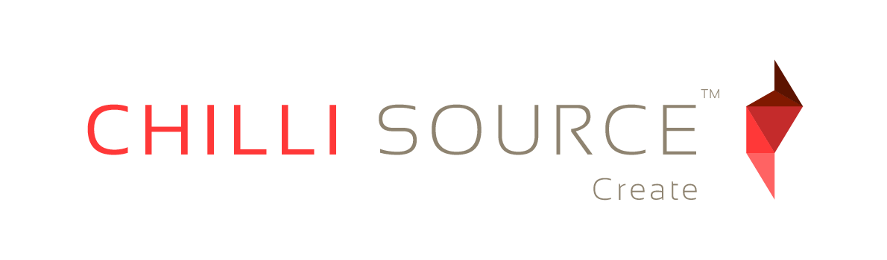

Chilli Source v1.3.3
====================

Chilli Source is an open source, cross-platform game engine designed by game developers for game developers. It is completely free to use, released under the MIT License.

Links
-----
* Chilli Works [Website](http://chilli-works.com/)
* Chilli Source [Documentation](http://www.chilli-works.com/learn/)
* Chilli Source [Samples Repository](https://github.com/ChilliWorks/CSSamples)

Getting Started
---------------
The [Project Setup](http://www.chilli-works.com/learn/tutorials-2/project-setup/) tutorial provides a good starting point for working with Chilli Source. It demonstrates how to create and build a new project. Also check out the other tutorials for more information.

If you encounter any bugs please report them using Github Issues. If you have any development questions post them on [Stack Overflow](http://stackoverflow.com/)--we will be checking it as much as we can. Chilli Source doesn't have a Tag yet so make sure you mention Chilli Source in the title.

Contribution
------------
Information on how to contribute can be found on the [Website](http://chilli-works.com/).

---

Built with Cricket Audio
 [www.crickettechnology.com](www.crickettechnology.com)

Usage of the Cricket Audio System is covered by the Cricket Audio free license (described at [http://www.crickettechnology.com/free_license](http://www.crickettechnology.com/free_license)). 
 For other licensing options, please visit [http://www.crickettechnology.com/source_license](http://www.crickettechnology.com/source_license).